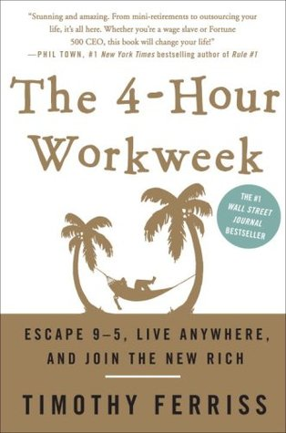

🔗 Link : [Goodreads](https://www.goodreads.com/book/show/368593.The_4_Hour_Workweek)

⭐️ Rating: 6/10
## 🚀 The Book in 3 Sentences

1. Live today and think big: follow your passion and don't conform with mediocrity
2. Be a doer driven by actions and not lofty goals
3. Minimalism is key: focus on the important and dismiss the rest

## 🎨 Impressions

Very controversial and extreme attitude on (egoistically) pursuing your goals. It nevertheless contains inspiring advice. I was most excited about the vision to combine work aspirations with exploring the world. The author is a bit narcissistic, but he has distilled some principles that are helpful to being successful. His minimalism and assertiveness about his ambitions resonated with me. 

### How I Discovered It

[Derek Sivers](https://sive.rs/book/4HourWorkWeek)

### Who Should Read It?

Those interested in starting an own business to be independent.

Those looking for inspiration on how to gain freedom to do what you want.

## ☘️ How the Book Changed Me

How my life / behaviour / thoughts / ideas have changed as a result of reading the book.

### Goals

Be confident to reach big goals. Mediocre goals, lead to mediocre efforts.

It is far more fun and lucrative to leverage your strengths instead of attempting to fix your weaknesses.

Time is our biggest resource. Measure money not by total-income but €/hr.

### Don't wait for the distant future

Set short goals in the range of 3-6 months. If set too long, the future becomes an excuse for postponing action.

Conditions are never perfect. "Someday" is a disease. If it's important to you, and you want to do it "eventually", just do it and correct the course along the way.

Ask these questions when you are afraid of taking action:

1. What could happen in the worst case?
2. What would be necessary to fix it?
3. What would be the gains of doing it?
4. What am I postponing out of fear? 

The fearful things are most important. Get out of your comfort zone every day!

### Be ambitious

Set aggressive deadlines for projects. Otherwise, the unimportant becomes the important.

### Be a doer: reach for precise actions instead of vague goals

Shift goals from ambiguous wants to defined steps.

Convert each "being" into a "doing".

Focus on demonstrating results instead of showing dedication.

### Do what feels uncomfortable

Do uncomfortable things constantly. E.g. : Ask girls for numbers. The result doesn't matter it's only about losing the fear.

> Ask for the phone numbers of 2 attractive women each day. Maintain eye contact. The real goal is not the numbers, but getting over the fear of asking, so the outcome is unimportant. "Excuse me. I know this is going to sound strange, but if I don't ask you now, I'll be kicking myself for the rest of the day. I'm running to meet a friend, but I think you're really gorgeous. Could I have your phone number? I'm not a psycho - I promise. You can give me a fake one if you're not interested."

### Minimalism

The 80/20 rule:

Which 20% of sources are causing 80% of my problems and unhappiness?

Which 20% of sources are resulting in 80% of my desired outcomes and happiness?

What are 20 % of the people or activities that bring joy?

Focus on the important tasks and ignore the rest

Three times per day, at schedules times, ask yourself: Am I being productive, or just active? Am I inventing things to do, to avoid the important?

Batch shallow tasks: email checking, paper work

Raise the bar: say "no" to absolutely everything. Make it your default answer. Don't make up lies.

Learn to ignore all information and interruptions that are irrelevant, unimportant, or unactionable.

Get rid of everything that stresses, distracts or isn't adding much value

### Happiness

Boredom is the enemy, not failure. Chase what excites you!

If you can't define it, or act upon it, forget it

## 👷🏼 What do I want to apply to my life?

- Do more travelling - I can also work and study from there
- Set deadlines to my projects
- Substitute "I want to be" with an action
- Define a mini (uncomfortable) challenge every day
- Ask myself more regularly: "Am I being productive, or just active?"
- Check mail once daily and phone as few as possible
