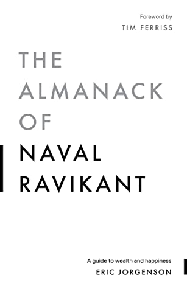

🔗 Link : [Goodreads](https://www.goodreads.com/en/book/show/54898389-the-almanack-of-naval-ravikant)

The book is available for [free](https://www.navalmanack.com/)!

⭐️ Rating: 7

## 🚀 The Book in 3 Sentences
1. Only invest for the long-run: be it relationships, learning, money
2. Time is your most valuable resource. Spend money to buy time.
3. Be present in all that you do and meditate.

## 🎨 Impressions

### How I Discovered It
I became a fan of Naval through his [episode](/posts/2021-01-12-best-of-podcasts) on the Knowledge project. Of course, I wanted to read this book after Eva Keiffenheim recommended it.

### Who Should Read It?
I found it helpful to define life principles. Having them brings clearity, allows to prioritize and eases decision making. Does that sound good?

## 👷🏼 What do I want to apply to my life?
I want to spend more money to save time for what matters to me. I want a simple lifestyle, but outsourcing cooking, chores, bureaucracy is the luxury I aspire.
Commute is also a big time killer. The housing location is an important factor to me.

I want to defend my values more strongly, by speaking up and being less agreeable.
Accept to be disliked by people with different views.

I want to pay more attention that my environment (location, relationships, job) are nurturing my development and aligned with my principles.

## 📒 Summary + Notes

### Go deep and long-term
Invest deeply, when you find the right thing to do, when you find the right people (also applies to learning). Sticking with it for decades is really how you make the big returns in your relationships and in your money. Go all-in to benefit from compound interest.

Let go, once you are are not fully convinced. When you're dating, the instant you know this relationship is not going to be the one that leads to marriage, you should probably move on. When you're studying something and realize you are never going to use the information, drop it.

To make an original contribution, you have to be irrationally obsessed with something.

## Spend to improve your time spent
I hate wasting time. I'm very famous for being rude at parties, events, dinners, where the moment I figure out it's a waste of my time, I leave immediately.

Value your time. It is all you have. It's more important than your money. It's more important than your friends.

Set and enforce an aspirational hourly pay rate. How much is my time worth? Live your aspirational lifestyle (or visualize) and see how much you need in a month (+ retirement). How much time do I want to reserve for other things? ^4135df

You may want to eat your healthy home cooked meals, but if you can outsource it, do that instead. It's one of the few luxuries I aspire!

You don't get rich by spending your time to save money. You get rich by saving your time to make money.

If fixing a problem will save less than your hourly rate, ignore it. Doing something to not lose money (return broken speaker, argue with electrician...), might be more expensive. Opportunity cost! If outsourcing a task will cost less than your hourly rate, outsource it.

## Priorities
The big decision in early life are: where you live, who you're with, and what you do. Spend time to decide and invest in getting options on these!

If you're going to live in a city for ten years, if you're going to be in a job for five years, if you're in a relationship for a decade, you should be spending one to two years deciding these things.

## Values
I think you just have to be very careful about doing things you are fundamentally not going to be proud of, because they will damage you.

The first time someone acts unacceptably, I will warn them. By the way, nobody changes. Then I just distance myself from them. I cut them out of my life. 

The closer you want to get to me, the better your values have to be.

It's possible to be honest and positive. Tell what you think! Charisma is the ability to project confidence and love at the same time.

If you can't decide, the answer is no.

For old problems like how to keep your body healthy, how to stay calm and peaceful, what kinds of value systems are good, how you raise a family, and those kinds of things, the older solutions are probably better.

Happiness is the absence of desire.

You can literally destroy your happiness if you spend all of your time living in delusions of the future.

I have lowered my identity. I have lowered the chattering of my mind. I don't care about things that don't really matter. I don't get involved in politics. I don't hang around unhappy people. I really value my time on this earth.

Don't beat yourself up saying: I need to do this and that. No, you don't need to do anything. All you should do is what you want to do.

Whenever we say we're going to try to do something or try to form a habit, we're wimping out. The reality is when our emotions want us to do something, we just do it. If you want to go approach a pretty girl, you just do it.

## Career
For juniors, the single most important thing about a company is the alumni network you're going to build.

Trying to build business relationships well in advance of doing business is a complete waste of time.

Work intensly and then rest intensely.

CEOs are highly paid because of their leverage. Small differences in judgment and capability really get amplified.

## Via negativa
Great ideas come when you are bored. Make time for it! Leave empty times in your calendar.

I do view a lot of my goals over the next few years of unconditioning previous learned responses or habituated responses. Subract, instead of always trying to add. Via negativa.

I think being successful is just about not making mistakes. It's not about having correct judgment. It's about avoiding incorrect judgments.

When it comes to medicine and nutrition, subtract before you add.

## Accept
Just accept how things are. You don't make any decisions. You don't judge anything. If I do that for ten or fifteen minutes while walking around, I end up in a very peaceful, grateful state. Choiceless Awareness works well for me.

As you watch your thoughts, you realize how many of them are fear-based. The moment you recognize a fear, without even trying it goes away. After a while, your mind quiets.

### Life philosophy
At the very least, I do not want my sense of self to continue to develop and strengthen as I get older. I want it to be weaker and more muted so I can be more in present everyday reality, accept nature and the world for what it

The less you want something, the less you're thinking about it, the more you're going to do it in a natural way. The more you're going to do it for yourself.

It doesn't matter what others think, it matters how you act to their behavior. So rather try to be your best self, while embracing (outspoken) feedback from others.
