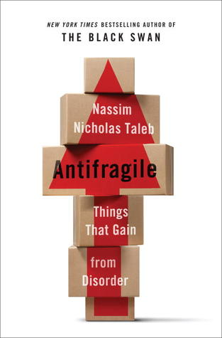

🔗 Link : [Goodreads](https://www.goodreads.com/book/show/13530973-antifragile)

⭐️ Rating: 8/10

## 🚀 The Book in 3 Sentences

1. We can do well in a complex world we don't understand
2. Embrace to live in an unpredictable world and prepare for it by avoiding extreme harm.
3. Our world is non-linear: Many of our options might be useless, but one success can pay it all off.

## 🎨 Impressions

A good friend of mine read all of his books and liked them a lot, so I decided to choose one of the book series to see for myself. I chose Antifragility because many said that it is the most comprehensive - summarizing a lot of the ideas from the other books and applying it to life.
Indeed, I found a lot of gems, although it takes some patience to go through this thicker book (519 pages) and all the rambling and opinions of the author that are placed in between.

I'm sure I missed more than a few ideas, so it might be worth a second read.

## 📒 Summary + Notes

### Life philosphy

Stoicism is neutral to fate. Don't try to evade your fate but benefit from it.

Wealth doesn't make happy, because it leaves more to lose. And we are naturally more averse to losses.

Assume that the worst thing has already happened and everything else is a gain. This is especially important when we are doing well, since that is when we are most fragile.

Randomness makes life exciting. Plan less and be more spontaneous.

Procrastination can be a good sign to not overdo something that is not important.

A free person is someone who cannot be squeezed into doing something he would otherwise never do.

Switch the blame from the inability to see an event coming. Not seeing a tsunami or an economic event coming is excusable; building something fragile to them is not.

### Barbell effect

Go for the extreme, the average doesn't matter. Count loyal fans, don't care about haters.

Provide for the worst and let the good things take care of themselves.

People avoid stressors, because big stressors are harmful. We neglect that small stressors are beneficial. We don't grasp the non-linearity of effects.

Be extremely risk averse to disaster and take small risks with potential high returns on the other side. Never go for the middle.

Success comes with fragility: you now have a lot more to lose than to gain.

If you put 90 percent of your funds in boring cash and 10 percent in very risky securities, you cannot possibly lose more than 10 percent, while you are exposed to massive upside.

People tend to prepare for small probable risks but neglect the worst unpredictable catastrophes.

Being at the limit pushes ourselves. Be it innovation, muscles.. We are also more effective with our time, when we are overloaded with work.

Being thrown at a thousand pebbles is much less harmful than one big stone. The effect is non-linear. Many small transactions don't hit the market, but one huge can crush it.

Averages don't count as much, when the objective highly fluctuates around this average. Antifragility is when the average of the squares is more than the square of the averages.

### Resist your intuition

People prefer small continuous gains. On the other hand we prefer abrupt losses. Act contrary to your intuition. Make losses small (although they feel more painful) and allow for large gains (although they seem relatively less)! We have an ill sense of pain. Little harm is disproportionally more painful than big harm.

People avoid stressors, because big stressors are harmful. We neglect that small stressors are beneficial. We don't grasp the non-linearity of effects.

Religious fasting is a mechanism for the disease of food abundance. Varying the diet and providing stressors on the diet might be good (?)

### Avoid extreme risk

Don't let terrible things happen to you. We are in control of most things that happen. Be very risk averse against big losses.

Prepare for the worst instead of trying to predict the unpredictable.

Nature builds reserves to prepare for what is worse than before. Yet human systems are often build for "effectiveness". With disastrous consequences in case of slight deviation..

Don't plan on the edge. It might work for smooth conditions, but slight deviations can have disastrous results. Avoid big risks even though they are improbable. A cheap plane ticket with short connection time and tight schedule poses the risk of spending a huge amount in case of a delay.

Praising the benefits and efficiency of a solution should not go without including the immense cost in case of a rare failure.

### Our non-causal world

Green lumber fallacy: ignorant trader who mistakes that lumber is painted green instead of its meaning for freshness. The trader can still be very successful..

Knowledge is often wrongly attributed to skills. Trading requires heuristic techniques, and trade observations, not knowledge about lumber or economic theories..

Lumber fallacy: most expected oil prices to rise due to Kuwait war. We mistake them to be correlated, but oil price prediction doesn't require knowledge about the war situation in the middle east; in fact prices plumbed.

Leverage comes from asymmetry. Bet against the main stream??

As humans, we want to put everything into a narrative with causality. But are we sure that education brings wealth?

Influential people are not necessarily knowledgeable. Take some tech entrepreneurs, finance people..

### Decision-making

What you learn in the class room mostly remains in the class room. Most value is found outside. Learn what intrigues you, this is what will stick in your brain.

What most others know, will most likely not be very valuable for you. Find your own niche of skills.

Use simple decision-making heuristics. One argument should be enough to convince.

The unnatural has to prove its benefits, not the natural.

Don't mistake absence of evidence, for evidence of absence.

One cannot tell if a person with skills will succeed, but we can pretty much tell the negative. Via negative: Ask: what would lead to failure? Then avoid that.

Vía negativa. We know much more about what is wrong than what is right. So it is about not being wrong or stupid rather than being right and smart.

The learning of life is what to avoid.

We learn best from stressors. We benefit most from those wo tried to - but eventually failed - to harm us, rather than from those who have tried to help us (say with “advice”).

Decide based on fragility, not probability.

There is no free lunch. If you don't find the downside, it is most likely that there is a concealed trap somewhere.

Skin in the game: Hammurabi’s code: If a builder builds a house and the house collapses and causes the death of the owner of the house - the builder shall be put to death.

### Subtract, don't add

Knowledge grows more by subtraction. Knowing what is wrong (what to subtract) is less fragile than assertive statements.We know more about what something is not than what something is.

Most benefits come from subtraction. Not smoking is much more beneficial than the combination of the positive effects of many medications.

Living poorer than we are, might slim away many unnecessities that harm us. Trust in what is natural (it has persisted) and be sceptical of the new.

### Innovation

Bottlenecks are the source of squeezes (1 percent increase in wheat demand doubled the price)

Innovation is about saying no to many things. Saying no to the wrong ideas is very important.

Technology and inventions come from tinkerers and practitioners, not theorists. Many successes are claimed to stem from scientific theories but actually they were developed afterwards. They fit a narrative in hindsight: Professor who teaches birds to fly..

Simple inventions like suitcase with wheels were invented after we went to the moon, even though they are so useful. It affected our lives much more than stepping on the moon.

The fragility of every startup is necessary for the economy to be antifragile. So some parts on the inside of a system may be required to be fragile in order to make the system antifragile as a result.

We rely more on water than on cell phones but because water does not change and cell phones do, we are prone to thinking that cell phones play a larger role than they do.

Trial and error is small loss with big gains! It wins over intelligence! Many inventions came from the prior.

### Time shows what's valuable

The difference of perishable things and non-perishable: The life expectancy of books grows over time, whereas for technology it shrinks.

Be sceptical of medicine. Short term benefits might appeal, but what about long term harm? Do we really do better than Mother nature? Only in extremely ill condition, are the benefits large relative to iatrogenics (disease caused from medical treatment)..

### Desire

We tend to compare the differences of what seems similar and focus on the similarities of different things. This makes us desire to buy the newest and forget how we once appreciated which we know dislike about our device (smartphone.. car)

### Get as many options as possible

Always go for what provides many options.

The more options, the better. Be it vacation, house renting or investing. You don't need to be right most of the time if the upside is antisymmetric.

### Act less

It’s much easier to sell “Look what I did for you” than “Look what I avoided for you.” Of course a bonus system based on “performance” exacerbates the problem.

Give more weight to opinions that conflict interests and favor not acting: A pharmacist who advocates starvation to cure diabetes would be more credible than one who favors the ingestion of drugs.

We tend to micromanage too much. The challenge is to distinguish the signal from the noise.
