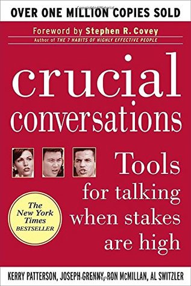

🔗 Link : [Goodreads](https://www.goodreads.com/book/show/15014.Crucial_Conversations)

⭐️ Rating: 8/10

## 🚀 The Book in 3 Sentences
1. We can be honest and critical but also have a healthy dialogue, when approached correctly.
2. To step out of heated feelings, we need to trace back the path of action (storytelling!)
3. Always restore safety before opening a discussion.

## 🎨 Impressions
The book teaches pratical techniques to deal better with high stake conversations and includes many examples. It is easy to digest and often feels obvious, but taking it into practice needs repetition and reflection. I'm listening to the book for the second time now. When mastered into practice this book can be worth gold, as the many letters from readers indicate. 

### How I Discovered It
Audible suggestion

### Who Should Read It?
I am sure everyone can benefit in their personal life. In business, especially people in managing positions will find it helpful.

## ☘️ How the Book Changed Me
I used to be very diplomatic and soft in conversations. Ofen, I would rather downplay my thoughts and opinions to avoid conflict or irritation. This of course does not lead to good outcomes. The book revealed to me that it's very possible to openly and honestly address touchy topics.

Many times discussions fail because, we are caught by our emotions. The concept of path to action makes clear how our strong feelings often stem from stories we make up from observations. We don't judge by facts but by stories. It takes attentive observation and thinking to step out of this vicious loop.

## 👷🏼 What do I want to apply to my life?
Observe my signals of how I react to piling up emotions in crucial conversations.
Only then can I step back and remind myself what I'm really trying to achieve.  Only then can I question my story and think of other reasonable interpretations of the facts.

## 📒 Summary + Notes
Forms of silence: masking, avoiding, withdrawing.  
People get silent when safety is lost. Safety is when you can say anything.  
Masking: underestimating, sugar coating: "That's quite an unusual idea you came up with"
Avoiding: change topics: "What do you think of the dress?... I like that blue, it's my favorite color."
Withdrawing: exit conversation: "Excuse me, I need to go and do x"

Forms of  violence: controlling, labeling, attacking.  
Controlling: cut others off, overstate, change topic. Hyperboles are used due to lacking facts  
Labeling: "your ideas are Neanderthal.. Don't Listen, they are.." 
Attacking: belittle, say bad things about others

When we are verbally attacked, adrenaline kicks in and diverts blood flow from brain to body parts for flying. So, take a second and don't respond immediately to strong emotions.

We tend to stress small differences instead of looking for similarities. Try to agree and add. If you don't agree at all, compare the views, but don't disagree

### Decision making
See discussion as a way to collect views and ideas not as an approval to make decisions on others behalf.
Clear up how to make a decision. While everyone should add to the pool of meaning, not necessarily everyone is involved in the decision. Be clear on that.  

- be specific in assigning responsibility: "we" means "not me"
- define deadlines  

### Path of action
observation -> story -> feelings -> action

### Dealing with difficult situations  
When people invent ever new excuses or a single instance seems ridiculous to bring up mention the pattern: Instead of don’t say this.. say don’t say things that might hurt your sisters feelings.
Instead of just fixing the Alarm clock, say sure if that helps that you are not late anymore.

On touchy topics. Mention difficulty to bring it up and show good intention. 

Crucial conversations are not all or nothing. You cannot force the other to have dialogue, but by consistently signalling readiness for dialogue, you can eventually restore safety.

Touching can help restore safety among friends and family.

### 0. Reflect + prepare
Define your goal: I want a fair share of inheritance and keep a good relationship with my sister

Prepare the facts. Be specific in your critique. Instead of you "You often do x when this happens", give an example!

Examine your role in the problem. We almost always also have a share in the problem. Try to see how a reasonable and rational human being could come to the others conclusion.

### 1. Establish mutual purpose
Show why they would want to have a conversation. "This is not easy, but I want to bring up a sensitive topic because it affects our relationship and that with others. I think it might help if you would know what others think."

### 2. State your path
"Since mom needed care, I've been taking care of her and covered her expenses. Her medication and therapy were a financial burden and I feel its fair that I get reimbursed for what I paid."
- give objective perception, then interpretation: make it tentative
- ask for other view

### 3. Detect when you go to silence or violence

### 4. Restore Safety
trace their path of action

Use mirroring: "You seem upset about my claim and feel that I'm trying to rip you off"; "So you are feeling misjudged and belittled, is that what is going on"?

Ask: "Is this what's going on?" "How do you see it?" "What makes you think that you did more?"

Use contrasting: "I did not mean to hurt you. What I really wanted is to show you is..."

Find similarities and agree: "I totally agree that you were also taking efforts to visit mom and that these trips were not cheap. It's just that the costs I covered were even bigger"

### 5. Getting the goal
Find common goals. People often pursue strategies: "I want to stay here". But the higher goal is "I want to be calm and not lose friends".

Make it easy for the other party to admit their fault: "Hey, I'm sure you are in a hurry and the queue is enormous. I also don't have much time and needed to come here 2 hours early... Do you agree that we should all be dealt fairly? Since most of us have rough schedules?" 
  
Don't coerce through power, show them the consequences of their behavior. There is often a connection between something we want to change, and some consequence they care about but are not aware of.

