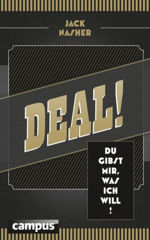

🔗 Link : [Goodreads](https://www.goodreads.com/book/show/17737312-deal?from_search=true&from_srp=true&qid=yJgtOjZSuy&rank=1)

⭐️ Rating: 8/10

This book is only available in German, but my notes are in English :)

## 🚀 The Book in 3 Sentences

1. Negotiation is about getting the best deal for both, it is not about finding a compromise.
2. Finding a good deal is about exploring all the options, it is not just about the price.
3. Negotiation is about psychology. Knowing the tiny tricks can protect you against them and give you an edge.

## 🎨 Impressions

This is my second book on negotiation, after having read [Never Split the Difference](/books/never-split-the-differences/). Interestingly, both share the same core message, that compromises should be avoided. In most cases it is possible that both parties get what is important to them. I feel that this book was more practical, since it provides advice on making better deals when buying a car, negotiating a salary, how to get the most out of long waiting times etc. The book is packed with tips and it did not get lengthy at any point.

## ☘️ How the Book Changed Me

How my life / behaviour / thoughts / ideas have changed as a result of reading the book.

Negotiation is an art and has many more dimensions than just the price. It revealed to me that being prepared with many variations of offers is a good way to find a deal that suits both.

I noticed that I lost lots of potential in the past by easily giving away things that are not very important to me, instead of using them as a leverage.

Moreover, I want to try out how accompanying a complaint with a satisfying solution is more effective.

I want to question my discontent more. It's probably not the action, but my interpretation that bugs me. To clear it up, I first state the facts to the other and then how I feel about it. I then ask about how they see it. This avoids attacking the other and indicates that I am not opinionated.

## 📒 Summary + Notes

### Always ask

Make the start to reveal information but in tiny bits and wait for the reaction of the other. Ask, don't talk, to get more information. Paraphrasing is effective to come to the same understanding.

When asking a friend, don't reveal your opinion before to get a more neutral view.

Ask questions, you will be surprised how willing people are to share information. Who can decide to negotiate? What offer do I get when I buy this as well?

Ask the big stuff early. People are more willing to give information before negotiation. Same for dating: question about previous partners during affair is much more likely to be successful. This also allows you to decide early whether to continue.

### Choosing a communication channel

After phone calls, send the agreements per email to avoid "I've never said this".

We act very different on mail, where we don't need to face the other. People are often more shameless, so avoid it whenever possible.

Mail is better to avoid unwanted information leakage, and you don't risk to be persuaded because you feel bad! However, it's also much more likely to get a no on mail. So choose your communication channel depending on whether you want to communicate a no, or get a yes.

### Winning your partner

Find similarities with the partner (even trivial and irrelevant ones).

Show weakness to make the other talk.

Find out what that person is good at. When he talks about it, your appreciation of him will increase. When you appreciate the power of the other, you won't try to take hold of it. Avoid that people with limited power, like officials, cling to their power.

Avoid disagreeing about negative points(e.g. you are expensive), but instead agree and provide a reason for it: Yes, and surely you value quality and service.

Don't attribute excuses to external factors, instead take the responsibility: I should have taken an earlier subway. This makes you more credible.

If it's not the action you feel sorry for, express sorry for the feeling you caused the other.

Build a bridge to make it easy for the other to change the behavior while maintaining his face: The no smoking sign is barely visible, but could you please go outside?

Make the other look like a winner. After closing a deal, tell the other how he made you pay more than you wanted..

### Be prepared

No preparation, prepares a sure loss. Expect the preparation to take much longer than the negotiation itself.

Don't negotiate when you are not prepared and it doesn't have your full attention (e.g. outside, driving).

Be clear which information is relevant before the negotiation. Questions are the key to get them!

Enter a negotiation with a clear goal and knowing your best fallback option. Don't be as vague as trying to haggle as much as possible!

Negotiate with your favorite option last, when you had the chance to negotiate a proper fallback option.

Never lament. Instead make an offer to mitigate: "I made a reservation and still need to wait a lot, therefore we go to the bar now, and I hope you invite us apéritifs while we are waiting". "I can do the work for two, but then I want more money": Concession + Claim. Think of something concrete you would enjoy, instead of hoping that the other party offers something.

### Finding the best for both

We tend to believe that our interests are incompatibles. Both might want to close the window, but one person wants fresh air, and the other sitting next to the window feels its drafty.

Find what the other values. When both partners get a job offer in different cities, find out what it means for each other and how it might be compensated with something of higher value.

A compromise is not win win, but lose lose. Most likely there is a way to find a solution where no one needs to give up on what they value.

Don't focus too much on the price. There are many more non monetary values which might be of high value for you and cheap for the other. E.g hotel reservation: breakfast and spa is cheap for them, but very nice for you.

Try to get different offers to see how much the other values each component. Maybe you find a better match!

### The role of psychology

Bringing a higher power into the negotiation, makes you more powerful. You might even invent it: I like it, but my wife says it's not worth more than x.. I need to consult with my manager.. Even the president does it, referring to the power of the senate.. It wins empathy that you are not the one making strong claims.

To avoid the partner from applying the trick of higher power delegation, ask early if there is a higher power: If that's the perfect house, could you make a decision today? Try to negotiate asap with the person in charge.

Scarcity makes things more attractive: The bus in Ghana always has only one seat left until the next actor gives up a place. Same for "last offer". Scrutinize if the scarcity is real.

Never indicate a selling price as negotiable. This shows that you don't even think it's worth this price.

Build up a connection before talking about business. When your friendliness clashes with your extreme business goals, the other experiences cognitive dissonance, which they try to harmonize (similar to Stockholm syndrome).

Consistency principle: explore principles or the slogan of the other and use them to make claims: The flyer guarantees freshness, it doesn't mention any exclusion close to final hour.

When the police stops you, keep them from writing something down through questions and explanations. As soon as he writes it down, he will file the claim due to consistency (show no weakness).

Deadlines are often made up to push us to a deal.

The phony trick: when wanting to buy something, let people you know make very low offers and then make a slightly higher bet. Your low offer will appear high compared to the others.

Be wary of the good-guy bad-guy trick. The good guy tries to win your empathy by protecting you from the outrageous claims from the bad guy. If detected, mention it: "I've never seen such a good cop bad cop play"..

Sound reasonable by bringing objective measures in to play. Before making the other aware of the consequences, ask them if they accept the criteria: "Do you find it reasonable to compare prices to be fair?".

People prefer distributed wins (finding 2x 10 Euros vs 1x 20 Euros), but losing at once. Chunk advantages and perks to make them seem more.

Humans have a strong sense of fairness and even reject deals that are beneficial for them.

The absolute price limit can be detected by ever decreasing concessions.

Framing: Put arguments that correspond to the others view. If your boss wants to hire the best, argue how an assistant would give more time to focus on the core work. If he wants to save money, argue how it would stop the expensive work force from spending time doing paper work and copying.

Overcommitment phenomenon: After a big time investment, we are eager for closing a deal. Don't consider sunken cost, but always consider if the deal makes sense. Be wary of low balling: negatives are presented very late. On the other hand, you can use it to negotiate a better deal. Ask the other GRADUALLY for documents, information.. It's easy to say no in the beginning, so take it slowly. At the end of a long negotiation, you can ask for an upgrade, as if it were self evident. "the gas tank will be filled right?" after trying 10 different suits, ask "which tie is included?"

### The first offer and haggling

Be the first to make an offer for anchoring, unless you don't know anything.

Don't take absurd offers from the other party seriously / ignore them. Shrug together - body language seems more credible than words. Avoid that their offer becomes the anchor.

Set the anchor as a starting point for discussions. Signal willingness to negotiate: Through a rough estimate, I think it's worth... but maybe I missed something.. Last year the bonus was such, but I understand if it could not be that much this year.. My colleague earns that much, but I see that you might not be able to pay as much.. I think the car is worth its price, but our budget is only such..

Let them make the middle deal offer. "There is not a lot missing between us, let's come to terms".. When they suggest it, you have still room to negotiate further.. I need to discuss it.. Now we are so close, how about meeting in the middle and close it..

The best time to haggle is after having a concrete offer from the partner and before accepting it. Before that, they might still decide for another option and after accepting it is too late.

### Never give without taking

Never make concessions easily, even if they don't cost you anything. Play them as sacrifice on your side to claim something.

Make concessions conditional; When you want/do that, then I want/do that. This way you make the other think what he has to offer, before he makes a claim.

If you make a high claim and then easily make concessions, you give the impression that you were trying to rip off.

The positive effect of concessions diminishes quickly, so ask for something in return immediately.

Agree on various unimportant points, to ask for something that is important to you.

When the other reveals a limitation / restriction, pretend that you are disappointed and ask for something in return: "If it's like that, then we get a free breakfast at least?"

When asking for a favor, have something in return to offer: When you stop throwing condoms in my garden, then you can always ring at my door when you need help or a warm coffee.

Don't be tricked by favors. We feel that favors need to be returned. If someone gives something for free, try to be prepared to have something in return to offer.

### Dealing with heated discussions

When a conversation heats up, take a pause to let the brain get control again. Or try to do something funny, e.g. put a rubber chicken on the table :D

To be vexed about someone else is to punish yourself for someone else's mistake

Don't respond to attacks with counter attacks. Instead agree with the others anger: You are right, I feel the same.. This steals the others thunder.

When feeling annoyed about being in a Hotline for a while and not getting help, remind yourself that the goal is to solve the problem, not to show off your ego or piss the person off.

It's the explanation and not the action that vexes us. When the wife puts away the cereal bowl, you feel annoyed because you think she won't let you in peace. But she might do it to please you. Ask yourself or better the other if your explanation is wrong.

When complaining, first mention the facts and then explain how you feel about it. Instead of "you are mean" say: "The last times it was like that.., I feel that...". Finally ask for the others opinion: Am I right? This indicates that you don't insist on your opinion.

### Dealing with and applying threats

Keep threats only about your interests: If I don't get a table now, then my guests will take it very badly.. I have a family now and need more money to provide for them. I'd like to continue working for you company, but what can we do?

Conflict resolution without threats: What would you do if you are constantly late?

Ignore threats and change the topic. Often it's an extremely emotional response and ignoring it, allows the other to maintain his face.

If the others threat is unavoidable, agree with their intent. Yes, we will try to find the best price.. Delegate power.. I'd like to give you better offer, but this is not in my power.

If you show that you are willing to leave the negotiation it strengthens your perceived power and also tests the other party. How important is a deal to him? If so, there is still room for negotiation.

### Put agreements on paper

Document negotiation results on paper. Send an email afterwards with the protocol. If you write it, you have the power to emphasize the points you want.. Add a phrase like: If you don't disagree within a week, I assume that you agree to the conditions.

Always include contract punishments. They are not a sign of distrust, but a general procedure (my boss insists..).

Be open for renegotiation of a contract. Both might realize inconvenient points. If the other refuses to renegotiate, abuse claims of the contract.. Call support and ask for technician until they want to terminate your contract.

### A few more tricks

Start on the lower end of the hierarchy. After a no, you can try at the next instance.. You only need one yes. Same goes for Hotlines: just call 2 if one tells you it's impossible.

Persistence is key. Don't give up after one no. But don't drive it to the extreme. Negotiations are not only about maximizing the outcome, but also about minimizing the input.

See most negotiations as a game. Will you remember it in 10 years? The playful attitude keeps you less emotional and gives the other less power, because you could always leave the negotiation.

We often mistake that what we know and perceive, is also what the other feels: Only few people can detect songs that the other knocks on the table. The knocker cannot believe how the other cannot hear it. This also applies to partners who know each other for years.

It's helpful to assume the position of the other to understand the situation better. E.g: examine the position of the accused when you defend your client. We tend to be overconfident about our own position, and the role reversal reveals our weaknesses.
