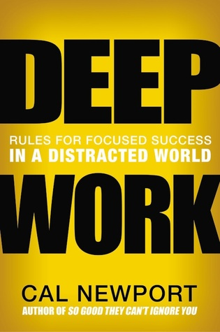

🔗 Link : [Goodreads](https://www.goodreads.com/book/show/25744928-deep-work)

⭐️ Rating: 9/10
## 🚀 The Book in 3 Sentences

1. Finding focus to think deeply is a hard with the distractions of ubiquitous connectivity today.
2. Concentration and focus can be trained and hugely supported through habits.
3. Deep work makes happy and leaves more time for other things in life 

## 🎨 Impressions

### Who Should Read It?

Knowledge workers who want to be more productive at their work. Those seeking techniques and inspiration to find more focus and train concentration.

## ☘️ How the Book Changed Me

How my life / behaviour / thoughts / ideas have changed as a result of reading the book.

I strive to be excellent in my profession. This requires focused, deliberate practice. I therefore design my day to make full use of my concentration capacity by blocking it and removing any distractions. Rituals and routines should help me to stick to it.

## 👷🏼 What do I want to apply to my life?

- Experiment with routines and rituals before and after deep work
- Plan the deep session and reserve time blocks the day before
- Try out the "productive walk": choose a problem and go out walking to ponder

## 📒 Summary + Notes

### What is Deep work and for whom is it?

- Deep Work: Professional activities performed in a state of distraction-free concentration that push your cognitive capabilities to their limit.
- Batch hard tasks into long, uninterrupted stretches.
- The amount of deep work of professionals seems to be limited to up to 4h on one day.
- Deep work doesn't work for all professions. Salesmen and CEOs are responsible for a lot of different tasks and need to make quick decisions and be highly available

### Focus on few things and fully engage with them

- Deeply focus on one thing at a time: the brain forms wrapping layers of myelin around the neuron circuits that fire intensively. If distracted, the neural activity is too disperse to strengthen the area for your desired skill.
- Minimize the amount of tasks to avoid attention leakage (things that are not yet fully dealt with will occupy your mind and distract).

### Resisting shallow work is hard

- It is natural to feel the desire to relieve ourselves from hard work. Smart habits are the way to combat them.
- The principle of least resistance: it's easier to be suggested what to do next (e.g. by checking inbox or messages) vs actively choosing and planning the prioritized work
- A difficulty of knowledge work is that it's results are not always easily quantifiable and appreciable compared to manual work such as craftsmanship. This makes us incline more towards doing quantifiable shallow tasks like answering emails or attending meetings.

### Deep work makes happy

- Our brains construct our worldview based on what we pay attention to. This contradicts the common belief that the small details of how we spend our day don't matter, because it's all about the large-scale outcomes. (That's analogous to the picture analogy. We tell stories about the big picture, but we really live in the small pixels).
We cannot always change the circumstances, but we can influence how we perceive it, e.g. by enjoying the small things (pixels) in life. Even if we have a serious disease, our picture is still made up of many, many pixels that we can appreciate.

    > Who you are, what you think, feel, and do, what you love — is the sum of what you focus on.

    *Winifred Gallagher*

    Our focus can provide a significant leverage on a positive attitude.

    Example: "Rather than focusing on your partners selfishness and sloth, you might instead focus on the fact that a festering conflict has been aired, which is the first step toward a solution and to your improved mood."

- When we spend a significant amount of time working with full dedication, it will feel important to us. If we spend enough time in this state of deep focus, our worldview will adopt this perspective as well.
- It also leaves less space for less pleasant things... The idle mind is the devils' workshop: when you lose focus, you are mind tends to fix on what's wrong. So being focused and limiting input, leaves less space for this
- Research shows that elderly people have learned to respond more strongly to positive imagery.
- Being in a flow (be absorbed by the moment) makes us most happy. "The best moments usually occur, when we are voluntarily stretched to our limits to achieve something difficult and worthwhile". This contradicts the common belief that relaxation is bliss.
- Work is easier to be enjoyable than free time, because it's structured and challenging:

    "work usually has built-in goals, feedback rules, challenges, all of which encourage one to become involved and lose oneself in it"

- Your work is craft and honing that skill and appreciating its "art" makes it meaningful:

    "The meaningfulness uncovered by such efforts is due to the skill and appreciation inherent in craftsmanship — not the outcomes of the work."

    Following this argument, deep work can be the source for a satisfying career. Instead of following "your passion" in your career, its more helpful to pursue the craftsmanship ideals.

### Find your deep work philosophy

**Styles:**

- Monastic: isolate as much from outside distractions as possible
- Bimodal: not everyone can afford complete absence due to substantial commitments. They therefore occasionally (e.g. monthly) dedicate extensive stretches of at least one day to work deeply.
- Rhythmic: transform deep work into a simple regular habit by reserving a fixed time for it. It ensures consistent progress.

### Techniques to foster deep work

**Routines:**

Minimize the amount of willpower necessary to maintain unbroken concentration through preparation and routines:
**Where and for how long?**
  try to have a dedicated place. Define an end time!

**How will you work once you start?** 
- define taboos and metrics. Otherwise, you will have to mentally litigate what you should and should not be doing
- reduce the amount of willpower needed:
  no phone, no mail
- No easy tasks that don't require full attention.
**How will you support your work?**
- I like to start with cup of tea. Have everything I need at one place. Do light yoga pauses to move.

**Collaboration:**

- working together can be helpful to deep focus for certain problems. The presence of the other waiting for your next insight can push you into deeper focus — avoiding the natural instinct to avoid depth.

**Grand gesture:**

- radical change to normal environment coupled with significant investment of effort or money to support a deep work task

**Stay on track:** 4 Techniques by Clayton Chirstensen:

**#1 Focus on the Wildly Important**

**#2 Act on the Lead Measures**

There exist lag and lead motivators. Lag motivators describe what you are ultimately trying to achieve, but they come too late to motivate persistence. Lead measures focus on the new behaviors that will help you reach your goal. Therefore, act on the latter. E.g. by tracking deep work hours.

**#3 Track your metrics consistently**

Log deep work hours consistently and evaluate how to improve and what to keep. Mark milestones and reward yourself.

**#4 Create a Cadence of Accountability**

Keep yourself accountable with weekly reviews.

**Productive meditation:**

Engage physically e.g. walking, jogging, driving, showering - and focus your attention on a single well-defined professional problem.
Its main purpose is to train deep thinking.

Steps to do before:

1. Review the relevant variables (options)

2. Define the next-step question using these variables ( How? What might go wrong?) 

Example: “How am I going to effectively open this chapter?”. This provides a specific target for your attention.
Be aware that we tend to repeat what we already know! Remind that you can come back to this idea later and bring the attention back.
Initially we tend to derail our attention to other seemingly important tasks. Resists this urge! That's the whole point of this exercise.
The final step is to consolidate your gains by reviewing clearly the answer you identified.

### The mind needs rest

Some decisions are better left to your unconscious.
For decisions that involve large amounts of information and multiple vague, and perhaps even conflicting, constraints, use your unconscious.

Rest doesn't mean being lazy but switching to something else. In fact, I feel better the next day when I spent my leisure time doing other challenging things as opposed to hanging around lazily. → Substitute distractions with quality alternatives for the brain.

Spending time in nature can improve your ability to concentrate.

Trying to squeeze a little more work out of your evenings might reduce your effectiveness the next day.

### Have a fixed Feierabend time

Finish work at five thirty: This strong break lets you avoid taking up shallow commitments.
Be strict about not allowing professional concerns after workday shut down.
Even short distractions might impede the shutdown advantages.

Have a shutdown ritual: Capture every incomplete task, so that you don't need to worry about it after work.

Put more thought into your leisure time. What fulfills you and makes you happy?

Be pragmatic but critical about sticking to your schedule: an important insight or high drive to do an unscheduled task is a perfectly valid reason to ignore the schedule.

### Reduce the time on shallow tasks

Be intentional and selective about communication:
- Limit email communication. Don't reply if a reply requires too much effort (too unconcrete) or if a reply doesn't promise any benefit. Can anything good happen if I reply?
- Before quickly replying, take a minute to think how to most effectively bring the "project" (as defined in GTD) implied by the message to a successful conclusion. Be concrete, assertive and don't leave open questions. 
- Steps to respond:
  1. Describe the process you identified. 
  2. Point out the current step.
  3. Emphasize the next step. 
    The recipient should find it easy to reply.

When writing emails, succinctly explain your concern and why the recipient should react to it. How can he benefit? Make a concrete proposal for how to proceed. Don't leave open loops.

### Others

Concentration is like a muscle that requires practice. It gets very hard if you are used to being distracted → make consistent efforts instead of trying hard during a short period of time.

Ambitious self-imposed deadlines help to force concentration.

Schedule an occasional break from focus to give in to distraction, instead of forcing yourself to resist distraction during a time period.

Selective tool choices: Adopt a tool only if its positive impacts substantially outweigh the negative.

For each goal define the two or three most important activities to reach it.
