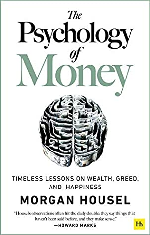

🔗 Link : [Goodreads](https://www.goodreads.com/book/show/41881472-the-psychology-of-money)

⭐️ Rating: 7/10

## 🚀 The Book in 3 Sentences

1. Accept the human psychology when investing: it's not about maximum return but about what we feel best with
2. Invest for the long term and broadly: the compounding effect is huge and it's the tails who make the big gains
3. Wealth is money not spent. It instead gives you control over your life, which is the biggest factor for happiness.

## 🎨 Impressions

### How I Discovered It

[Ali Abdaal](https://aliabdaal.com/)

### Who Should Read It?

Everyone who is not convinced of passive long term investing. 

## ☘️ How the Book Changed Me

How my life / behaviour / thoughts / ideas have changed as a result of reading the book.

- It is important to start investing very early: don't neglect the contributions  from my small initial investments
- I want to spend money on what lets me spend my time in the most meaningful way. I am willing to pay for stuff I can do myself but is hard for me or dull, e.g. repairs, repetitive tasks
- Market volatility is a fee and not a fine. It's the fee you pay to get access to high returns. Not a fine for taking risks.
- Bet on the success of the few. Failures don't matter if they finally somehow lead to success. Taking risks makes success more likely and failures are normal. But never risk failures that could destroy you completely.
- Also invest during bear market (time is your best friend ).
- Keep your expectations low. Wealth is not just about income but also about our spending behavior.

## 📒 Summary + Notes

Our notion of investing is hugely affected by the environment. Growing up in a bull market vs depression.

Compound effects are extreme and are the key factor for Warren buffets success. The key is to maintain assets for them to grow over time.

It's the tails who make the big gains. Consistently invest also during bear market.

The reasonable wins over the rational strategy because you are more likely to persist with the former. Theoretically best to invest with 50 debt ratio in early years, including bear market, but take the option you sleep well with.

It's a fallacy to believe that we remain the person we are right now. Therefore, it's good to save without knowing for what.

Don't worry about sunk cost, it's about the future and not past efforts. Don't go for extremes and bet on a bright future.

The price of a stock depends on your time horizon. Do you want to sell in a year, in a decade?

Humans are risk averse. Therefore, pessimistic news gain more attention. Whereas huge successes such as a big company growth in a few months may go unnoticed

We warp reality around our beliefs / wishes. If we believe that a recession is about to come, we take every sign as a confirmation, although there might be nothing behind it.. We are less critical in that situation.

Risk is what is left when you think you have thought of everything. We don't tend to accept the complexity of the world, but rather make the world fit our narrative. We need to come to terms with how much is out of our control

Define the rules by which you play and make sure you don't follow others who have different rules / goals. Bubble speculators...

Independence is the highest goal. It's about keeping expectations low to save enough.

Make decisions you feel good with. It is not rational to pay a house when interest rates are low, but it gives you the feeling of liberty. 
Same for cash. Keep a money reserve to decrease the likelihood to sell stocks for big investment.
