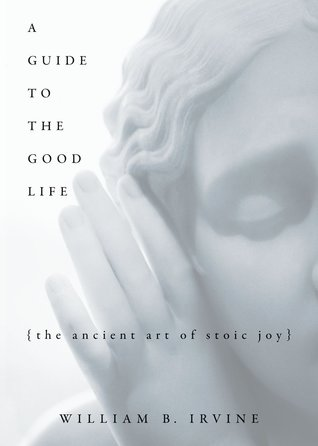

🔗 Link : [Goodreads](https://www.goodreads.com/book/show/5617966-a-guide-to-the-good-life)

⭐️ Rating: 9/10

## 🚀 The Book in 3 Sentences

1. Stoicism tries to improve quality of life by becoming more appreciative about our day to day experiences.
2. Stoics mentally prepare themselves for bad things to happen, to be less affected by them and feel less regrets.
3. Stoics believe that we need to change our mind and not external conditions/circumstances to have a tranquil and happy life.

### How I Discovered It

[https://fs.blog/knowledge-project/derek-sivers/](https://fs.blog/knowledge-project/derek-sivers/)

### Who Should Read It?

You want to find a philosophy of life. You want to have a more fulfilled and happier life. You think that materialism and consumerism is not the road to happiness. You want to be more robust to negative events and regret less.

## ☘️ How the Book Changed Me

How my life / behavior / thoughts / ideas have changed as a result of reading the book.

It fostered my determination on how I want to live and convinced me of Stoic principles. Without knowing, I shared many convictions before: the virtue of being frugal, purposefulness, robustness to judgement and emotions.. However, I became more aware of the power of self-control. I've been trying to become more disciplined with regards to my diet, exercise and getting up early, but there are many more dimensions that can benefit from it. The ability to gain more control over our desires was eye opening to me. Also, I want to apply negative visualization to become more appreciative about the people I care about, finiteness of life, moments and activities.

## 📒 Summary + Notes

I want to find a philosophy of life to be sure that my time is spend meaningfully. I don't want to regret having squandered it later.

Philosophy made a big leap forward around 500 BC: Pythagoras, Confucius, Buddha

Stoicism, unlike Cynicism, doesn't suggest to refrain from joy to prevent attachment to good things. Instead, it teaches to prepare ourselves for loss.

Religions teach how to behave morally, but not how to live a happy life.

Enemies are the first to discover your mistakes.

Hunger is the best appetizer. It makes you enjoy simple food with more pleasure.

Don't bother about things that are out of control.

Divide actions into those

- completely under my control
- partial control
- out of control

### Doing

Actions, not words, reveal our real values.

Stop lying to yourself, and admit your real priorities.

Start doing what you say you want to do, and see if it’s really true.

Know what matters most to you. Use it as your compass and optimize your life around it.

Focus is easier with urgency. Expand the close deadline situation into months or years.

Keep track of dull tasks and do them when you feel extremely unmotivated.

Fear is just a form of excitement, and you know you should do what excites you. That’s how you grow.

Refrain from time wasters like social media and video watching and instead make my art the main relaxing activity.

### Goals

Goals shape the present, not the future. If it was a great goal, you would have jumped into action already.

Judge a goal by how well it changes your actions in the present moment.

Ingredients for a good plan: Happy, Smart, Useful

### Priorities

Say no to anything less than great.

What do you hate not doing? What makes you feel depressed or annoyed if you don’t do it enough?

Subtract to be successful. Narrow focus and protect yourself against time-wasters. Most of us have too many commitments.

Future-focus vs present-focus: Future-focus is driven by self-discipline (exercise, invest, preventive health). It is more likely to lead to happiness of achievement at the expense of personal relationships which require a present focus. Be sure to switch to present-focus to enjoy life.

Each plan is just one of many possible futures. Collect them, let them sit for some time and reevaluate the possible plans regularly.

### Decision making

There are always more than 2 options.

"As an example, a friend was trying to decide whether to stick with his frustrating job or quit to start his own company. Options: build company outside of office hours and quit when its sustainable; show up at work and secretly work on your own company until they fire you; propose the idea to the boss and start it as a division..."

Brainstorm all options, including the ridiculous, before trying to decide on the obvious choices.

Think long term. Focus on few things for a few years, then on another for a few years, then another. You can do everything you want to do. You just need foresight and patience.

Make decisions when you have the most information: as late as possible.

Before you start something, think of the ways it could end. Sometimes the smart choice is to say no to the whole game.

### My fault

Everything is my fault. Seeing it that way, you feel in control and not wronged. There is nothing to complain about, instead there is something for me to learn from it.

### Building a business

Don’t start a business until people are asking you to.

Don’t announce your company. Don’t choose a name. Don’t make a website or an app. Don’t build a system. You need to be free to completely change or ditch your idea.

Obvious to you, amazing to others. Are you holding back something that seems too obvious to share?

Copying is not shameful. Look around for exciting ideas and imitate them. You can still offer something valuable and unique by giving it your touch.

### Job

Don't think of your job after office hours.

Don’t expect your job to fulfill all your emotional needs. Don’t taint something you love with the need to make money from it.

Future-focus vs present-focus: Future-focus is driven by self-discipline (exercise, invest, preventive health). It is more likely to lead to happiness of achievement at the expense of personal relationships which require a present focus. Be sure to switch to present-focus to enjoy life.
### Learning and Exploration

Explore different (music) styles. Be it Persian traditional, Indian classical, ’60s jazz, glitch, Bartok, Stevie Wonder (from ’72 to ’76), lots of Bach, Bulgarian choir...

Inspiration is not receiving information, but about applying it. It’s only when you stop and think of your work through this new perspective, that you actually jump up and go turn the idea into reality.

Pick a place that’s most unlike what you know and go. Mindless habits, like buying groceries, now keep your mind open, alert, and noticing new things. New arrivals in a culture often notice what the locals don’t.

Ask people to explain and show you how things are done. When they state a fact, ask how they know. When they state an opinion, ask for examples.

How about disconnecting from the world in a remote place for some time? Use it for deep focus and to become more self-aware.
