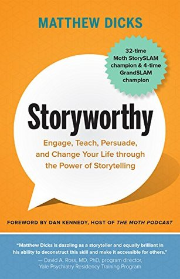

🔗 Link : [Goodreads](https://www.goodreads.com/en/book/show/37786022-storyworthy)

⭐️ Rating: 8/10
## 🚀 The Book in 3 Sentences

1. Life is full of story worthy moments
2. Knowing how to tell stories is useful for everyday life
3. The best stories aren't about extreme happenings, but those that the audience can most deeply relate with
<!--more-->

## ☘️ How the Book Changed Me

- I'm curious to find the story worthy moments in my mundane life -> pick one moment and note it down daily
- Increased awareness to be entertaining and enjoyable to be around with. Be it friends, family, coworkers, meetings... You are stealing other peoples time, make it worthwhile :)

# 📒 Summary + Notes

### Good stories are

- about you and not others. If others are involved, tell your side of the story.
<!-- (best friend, running on rainy day, kiss - > grudges went away and saved friendship) -->
- don't tell (boring) vacation stories
- not spectacular but tho1se that others can relate too.
<!-- (child not eating, take food away, but he suffered hunger when little, wife is understanding and hides it coz she is aware) -->
- they are about 5 second moments that are transformative. Each part of the story only serves to convey and explain this moment.
<!-- Jurassic Park is a good movie not because of the fancy animations, but because of the protagonists transformation to realize that child's are a big enrichment. Unconsciously these moments talk to our feelings and make them stick. -->

### Storyworthy moment journal

- life is full of story worthy moments but we often don't recognize them.
- make a habit of writing the story of the day down in 2 or 3 sentences.
- allows to see patterns and become aware of recurring behaviors
<!-- (grudgingly installing AC as way of fighting with wife) -->
- they make us become aware of each day and slows down our perception of life, because we remember more of it.

### Discover old moments

- do random shuffle sessions to dig up old stories. Start by writing down a list of things such as numbers, countries and let the thoughts happen
- Try first, last, best, worst for idea generation: E.g.: What was your first/ last/ best/ worst kiss, vacation, behavior...?

## How to craft a story

The story creation begins with finding the transformative moment (the end). Then find the beginning which is opposite to the end. Movies also often work like that. So you can assume that the the movie will end opposite to how it begins..

Make the beginning as short as possible and leave all details out. Only tell what it takes to convey the transformative process.

### Story telling techniques

**1. Big elephant:** tease the story.. make the listener curious.. "_When I was 9 years old, I wanted to disown my mother.. She was..._"

**2. Change color :** surprise the audience by making a switch in the previously suspected 5sec moment. Before revealing the true happening, contrast the situation to make it unexpected.

Obscure important details by listing them with other trivia or by embedding them in a joke.

**3. Backpack:** make the audience feel your situation.. Present my situation and how I struggle..

 <!-- _Failure to get gas from station without money.._ -->

**4. Breadcrumbs:** let the audience guess but don't give enough information to be right. Surprising answer...

**5. Hourglass:** slow story down with superfluous descriptions when they are excited to know what happens next.

**6. Crystal ball:** make a (hypothetical) prediction about future.. To make the audience wonder what happens next.. "_I know what's coming next.. He will call the police..."_

**8. But and therefore:** avoid and connectors. But and therefore imply contrast and change.

**9. Surprises:** Use unexpected contrasting descriptions.. "_My **toddler** is very **lovely**, but when it comes to food, he is an **asshole**._"

**10. Switch tenses :** Use the present if you want others to visualize this moment.

**11. Sympathy for underdogs:** marginalize yourself by something bad you did or how you failed before. It's about telling a relatable story, not showing off.

Somehow similarly, nervousness can even be good. It shows that its important to you. It connects you with the audience before you say a word

### Don'ts

- don't state a thesis at the beginning: "_This is a story about.._"
- increase the humor of a story by emphasizing the unexpected word.. (all normal, but I slept with a goat..)
