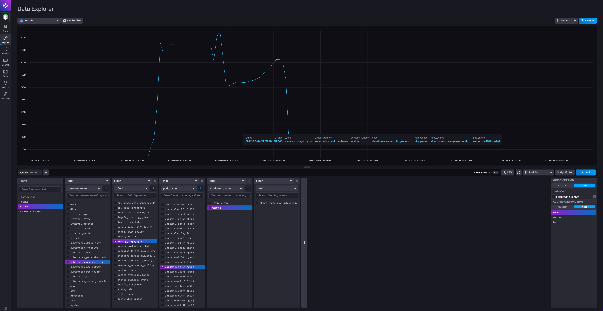

InfluxDB is an Open-Source timeseries database which can be used for monitoring Kubernetes clusters.
In this tutorial, I want to show you step by step how to get a dashboard with metrics on Kuberntes resource usage of podes and nodes. It's not difficult, but the official documentation is outdated and confusing, so I hope to make it easier for you.
We will use InfluxDB2 which includes a nice dashboard and supports the Flux QL query language.

### 1. Download [helm chart repo](https://github.com/influxdata/helm-charts) and add to helm:

    helm repo add influxdata https://helm.influxdata.com/

### 2. Deploy Influxdb2

No settings need to be adjusted:

`helm upgrade --install influx2 influxdata/influxdb2`

But you should note down the password for the admin user:

`echo $(kubectl get secret influx2-influxdb2-auth -o "jsonpath={.data['admin-password']}" --namespace tick | base64 --decode)`

To open the Influx UI, do:

`kubectl port-forward svc/influx2-influxdb2 8081:80`

Now, you can open `localhost:8081` and log in with user: admin and the before copied password.

### 3. Add Telegraf Configuration in Influxdb

In the UI sidebar, click `Data` and add "Telegraf Configuration". Choose Kubernetes and enter a name: (e.g `telegraf`).
Then, copy the API token.

### 4. Deploy Telegraf

We choose the Daemonset `telegraf-ds`, because it is expected for the `Kuberntes input` plugin, which among many others observes the node and pod resources.
Now open the `values.yaml` and add the following information under `config.outputs`:

        - influxdb_v2:
            urls:
              - "http://influx2-influxdb2.tick.svc"
            token: INSERT_TOKEN
            organization: "influxdata"
            bucket: "default"

The input plugins are configured by default.

Then deploy the chart:

    helm upgrade --install ds-telegraf influxdata/telegraf-ds -f values.yaml

### 5. View metrics data

If all went well, you should now receive metrics data and see them in the UI under `Explore`:

### 6. Connect local client with DB

If you want to query the DB through a locally installed CLI client or their Go-client, you can use the port-forwarding from earlier and use this adress to connect:
`kubectl port-forward svc/influx2-influxdb2 8081:80`.

This step was not so intuitive to me, because in InfluxDb 1 the service exposed the 8086 port for this. But now the UI and the database connection are both reachable through this port.

To test the connection with the CLI you can use:

`influx ping --host http://localhost:8081`

This is all there is to it. If you have any questions or find that my tutorial got outdated, please contact me :)
